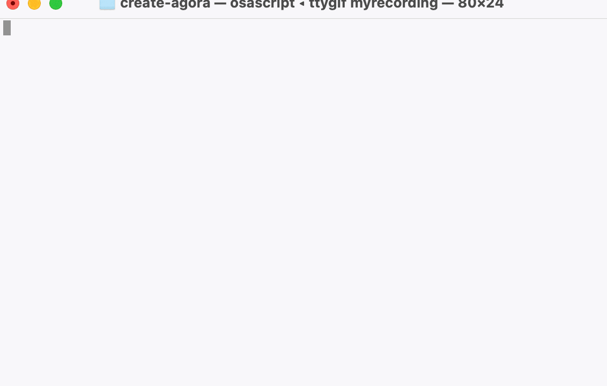

# create-agora

> **Compatibility Note:** Vite requires [Node.js](https://nodejs.org/en/) version 18+, 20+. However, some templates require a higher Node.js version to work, please upgrade if your package manager warns about it.



With Yarn:

```
$ yarn create agora
```

With PNPM:

```
$ pnpm create agora
```

With NPM:

```
$ npm create agora@latest
```

With Bun:

```
$ bunx create-agora
```

Currently supported template presets include:

- `vue-ts`
- `react-ts`
- `svelte-ts`

You can use `.` for the project name to scaffold in the current directory.

